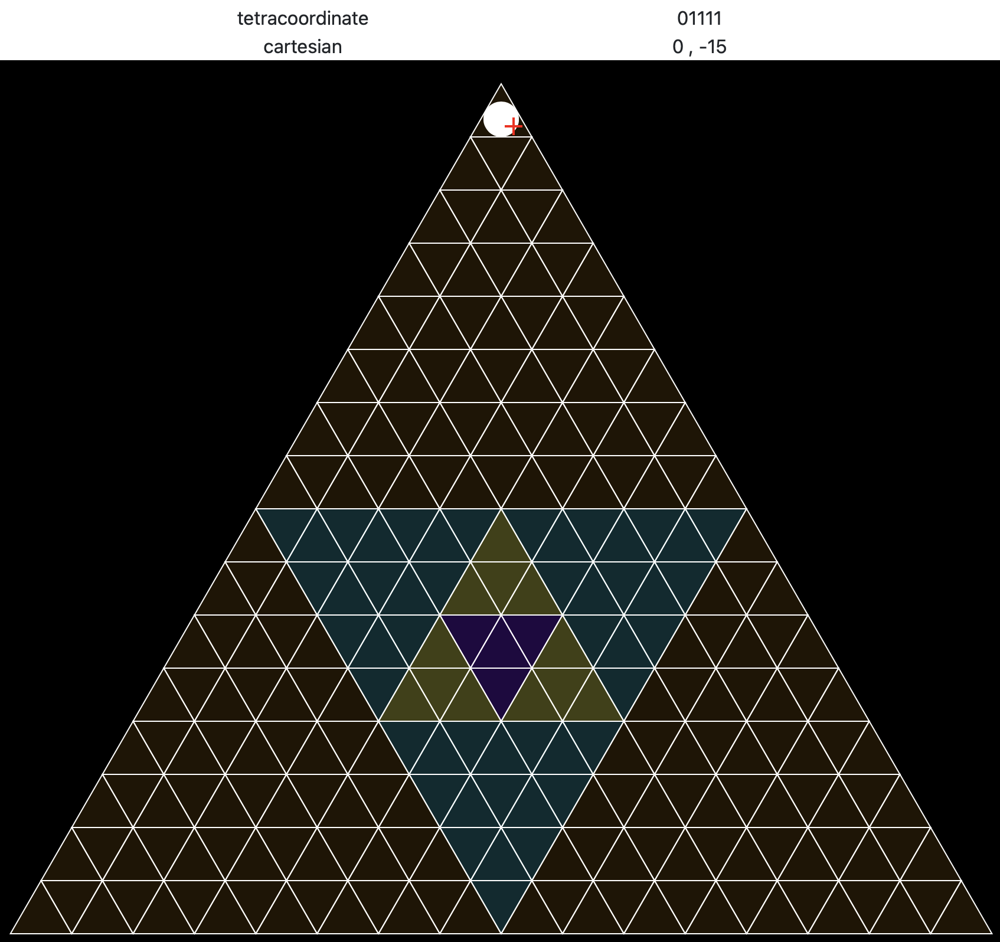

# Tetracoord Explorer

Tetracoordinates engine and calculator.



## CLI driver

Run cli driver with `npm run cli -- -e "<expression>"` to evaluate an arithmetic or logical expression with scalar and vector terms. 
See `npm run cli -- --help` for all options.

The program loops, prompting for a new set of opts after each expression is evaluated. So running with no input simply as `npm run cli` is convenient, and avoids some erroneous opt parsing when provided through `npm run`.

Examples:

```shell
# Evaluate scalar sum of three terms (5 + 5 + 5), each defined with a different radix,
# with info logs piped through optional dependency pino-pretty.
npm run cli -- -e "5 + 0q11 + 0b101" -l info
# result = 0d15

# Show same scalar result as quaternary
npm run cli -- -e "5 + 0q11 + 0b101" -s b
# result = 0q33

# Show same scalar result as binary
npm run cli -- -e "5 + 0q11 + 0b101" -s b
# result = 0b1111
```

```shell
# Show that -tc[0.111...] equals tc[1.0]
npm run cli -- -e "tc[0.1i] * -1"
# result = tc[0q1]
```

```shell
# Create a cartesian coordinate at (3 * cos(pi/6), 3 * sin(pi/6)) and convert to a tetracoordinate.
npm run cli -- -e "tc[cc[3*cospi6, 3*sinpi6]]"
# result = tc[0q22]

# Confirm that the same tetracoordinate 22 equals -202 (radix is implied 10 for ccoord, 4 for tcoord).
npm run cli -- -e "tc[cc[3*cospi6, 3*sinpi6]] === -tc[202]"
# result = true
```

There are many more example expressions `test/test_calculator.ts` as well.

### Calculator expression syntax

details pending

## Develop

### Tests

Run all tests with `npm run test`.

Pass opts and file patterns to `mocha` with `npm run _test -- <opts> <files>`.

- Run tests in a given file with 
`npm run _test -- <files>`.
- Run tests with a given substring in the description with 
`npm run _test -- -f <name> test/*`.

## Filesystem

### `src/`

### `test/`

### `public/`

### `pages/`

